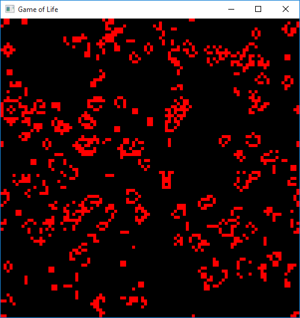
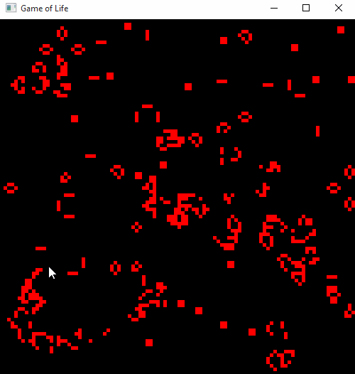

# Game of Life

A straightforward implementation of [Conway's Game of Life](https://en.wikipedia.org/wiki/Conway%27s_Game_of_Life) in C++ for Windows.

Some notes:
* You can create new live cells by clicking on the game area
* When the window is resized, the game area size adjusts and cells reset

Screenshot:  

GIF:  

